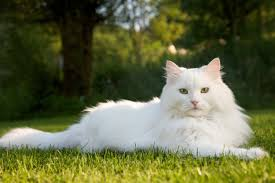
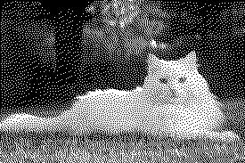

# Python Image Dithering

A simple Python project that converts images to **black-and-white** using **Floyd–Steinberg dithering**. It demonstrates how grayscale images can be transformed into visually appealing, dithered images using error diffusion.

---

## 📸 Example

**Original Image:**  
  

**Dithered Output:**  
  

---

## ⚡ Features

- Converts any input image to black-and-white.
- Uses **Floyd–Steinberg error diffusion** to preserve details.
- Automatically converts color images to grayscale.
- Easy to customize and extend for other images.

---

## 💻 Installation
Clone the repository:

git clone https://github.com/your-username/image-dithering.git 
cd image-dithering

Install the required Python packages:
pip install pillow numpy

🚀 Usage
Place your image in the project folder.

python: 
from PIL import Image
import numpy as np

 
Put your own images into these variables

📝 Notes
Works best with medium to high-resolution images. Very small images may lose details.

Processing large images may take a few seconds depending on image size.

⚙ How It Works
Converts the image to grayscale.

Thresholds each pixel to black or white based on intensity.

Calculates quantization error and diffuses it to neighboring pixels (Floyd–Steinberg algorithm).

This produces a black-and-white image that visually resembles the original grayscale image.

